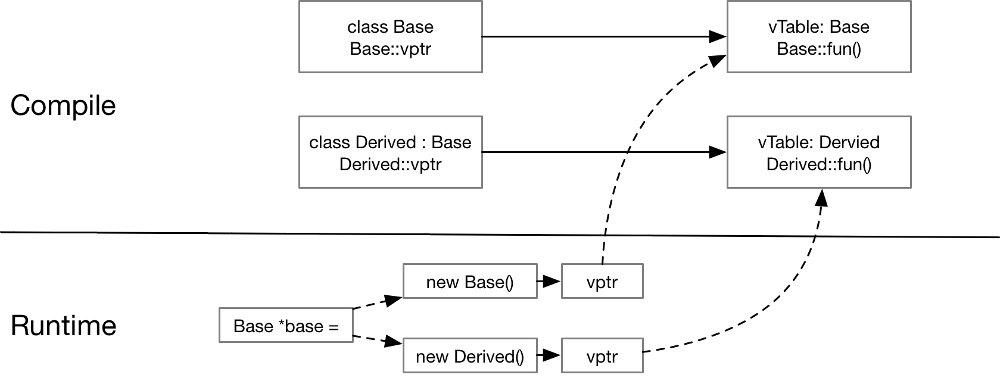

# C++ “多态” 学习笔记

## C++ 中的“多态”

C++ 中允许用户将一个指向基类的指针转换成其派生类的类型，并调用派生类的成员函数，“多态” 是编译器提供的
一种更为优雅的方式，可以将基类的指针动态的绑定到其派生类上，并调用其对应的成员函数：

``` cpp
class Base {
 public:
  virtual void fun() {
    std::cout << "This is Base::fun()" << std::endl;;
  }
};

class Derived : public Base {
 public:
  void fun() override {
    std::cout << "This is Derived::fun()" << std::endl;
  }
};

int main(int argc, char** argv) {
  Base *base = nullptr;
  if (strcmp(argv[1], "base") == 0) {
    base = new Base();
  } else {
    base = new Derived();
  }
  base->fun();
  return 0;
}
```

在上面例子中可以看到编译器在编译的时候并不知道`*base` 是指向 `Base` 还是 `Derived`, 只有在二进制程序运行
时根据程序的参数才会知道base是何种类型以及 `base->fun()` 应该运行哪个成员。

## 虚函数

当我们希望对某一个成员使用多态机制时，只需要在基类中将对应的成员函数声明为虚函数即可：`virtual void fun();`
编译器会使用 `vTable` 来记录这些虚函数:



1. 在编译阶段，编译器如果发现某一个成员函数是虚函数，则会使用 `vTable` 结构来记录这些虚函数，以及一个指向 `vtable` 的指针 `vptr` 指向虚函数表，这些额外的成员均有编译器自动添加到类的定义中，请注意 `vptr` 是在函数的构造阶段进行初始化的。 我们可以使用 GNU 编译器提供的 debug 参数 `-fdump-class-hierarchy` 将类的打印出来以便观察:

    ``` text
    Vtable for Base
    Base::_ZTV4Base: 3u entries
    0     (int (*)(...))0
    8     (int (*)(...))(& _ZTI4Base)
    16    (int (*)(...))Base::fun

    Class Base
      size=8 align=8
      base size=8 base align=8
    Base (0x0x7f1b50cde7e0) 0 nearly-empty
        vptr=((& Base::_ZTV4Base) + 16u)

    Vtable for Derived
    Derived::_ZTV7Derived: 3u entries
    0     (int (*)(...))0
    8     (int (*)(...))(& _ZTI7Derived)
    16    (int (*)(...))Derived::fun

    Class Derived
      size=8 align=8
      base size=8 base align=8
    Derived (0x0x7f1b509edb60) 0 nearly-empty
        vptr=((& Derived::_ZTV7Derived) + 16u)
      Base (0x0x7f1b50cde840) 0 nearly-empty
          primary-for Derived (0x0x7f1b509edb60)
    ```

1. 在程序运行时，当我们实例化一个类的对象时，构造函数首先会初始化对应的 `vptr`, 使其指向正确的 `vtable`，这样我们在调用 `base->fun()` 时就能够根据 `vptr` 指向的 `vtable` 找到应该调用的成员函数了。

## 参考资料

1. https://en.wikipedia.org/wiki/Virtual_method_table
1. https://www.geeksforgeeks.org/virtual-functions-and-runtime-polymorphism-in-c-set-1-introduction/