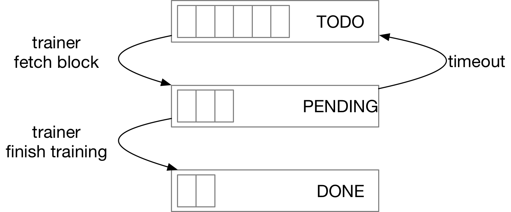
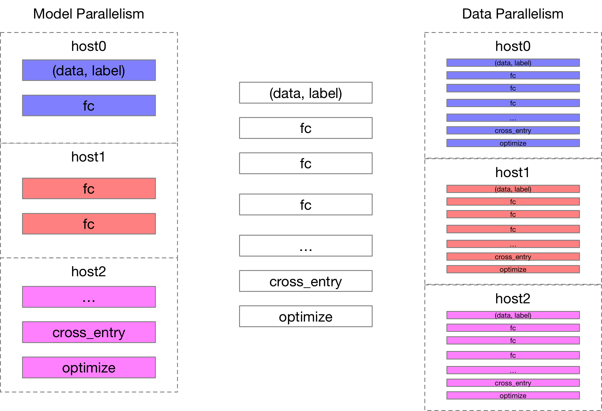

# 大规模分布式深度学习系统

## 背景

信息信息技术的发展，人类可以采集到的数据越来越繁杂和精细，在人工智能公司的 AI 系统中需要处理的数据也越来越庞大，并且随
着 AI 算法的不断演进，模型正变得越来越复杂，所需的计算能力也越来越高。这需要企业拥有一套功能强大的 AI 平台能够:
1. 调度不同作业，按优先级由高到低可以分为：实时作业、离线作业以及实验作业。
1. 对于深度学习类作业，不同的模型，需要的硬件也不一样，例如一些 CTR 类的模型由于模型比较简单但是需要处理的数据非常庞大
    ，所以需要 大量的 CPU 来完成训练，图像类模型则需要大量 GPU 芯片来完成训练等等。为了支持多种 AI 计算芯片（CPU, 
    GPU 以及 ARM等）以及不同的计算库（Nvidia CUDA，Intel MKLDNN 以及 cuBlas 等），训练框架需要能够在异构的集群完
    成大规模的训练任务。

## 通用计算机群 Kubernetes

为了能够将不同类型的作业调度起来，我们首先需要有一个分布式的计算机群，为了管理一个大规模的计算机群，我们也需要有一套
软件能够将机群管理起来，传统的机群管理软件如 MPI、Slurm、Hadoop、Kafka 等属于专用集群，他们的特点是只能管理一类
进程，不同的集群之间不可以共享计算资源。

还有一些集群管理软件，理论上可以调度不同的计算作业，例如 Hadoop Yarn，Mesos 等，但这些软件的弊端是需要为不同类型的
作业编写不同的 "Master" 进程，例如 MapReduce 作业需要根据 Yarn 提供的一套 API 来实现管理 Map 和 Reduce 进程的
中心节点，属于专用机群和通用机群的中间状态。

Kubernetes 是 Google Borg 的开源实现，它可使用户可以像管理操作系统中的进程一样调度机群中的进程，例如一个
Kubernetes 机群中有很多的计算节点 (Node), 每个节点上可以运行很多的进程（Pod），用户可以通过描述一个 Kubernetes
RecplicaSet 来告诉 Kubernetes 机群，该启动多少个进程（Pod），并且即使有节点失效，机群也可以自动的将进程在其他正常
的节点上将进程启动起来。
Kubernetes 还提供很多的 Object，来管理计算作业类进程(Kubernetes Job), 监控类进程(Kuberentes Daemon)等等。

## 弹性深度学习系统 Elastic Deep Learning

传统的 AI 计算机群如 MPI、Slurm 等，用户在提交任务时会指定一个固定的计算资源，当机群中没有足够的计算资源时，所
提交的作业将会一直等待，直到集群中有足够多的计算资源才会将作业调度起来。

举例来说，假设我们拥有一个 10 个计算节点的 GPU 集群，其中 5 个节点正在被占用，这时用户向集群
中提交一个需要 6 个计算节点的任务，这时任务由于没有足够的资源将无法被立即调度起来，需要等待其余 5 个节点的作业退出
后才能运行。这会产生两个问题：

- 用户体验差，并且无法快速的验证任务是否正确：用户提交任务后，需要等待一个很不确定的时间后才可以被调度起来；
- 集群资源利用率低：例子中的集群利用率只有 50%， 无法高效的利用率集群资源。

而[Elastic Deep Learning(EDL)](http://github.com/PaddlePaddle/edl) 则允许用户在提交任务时指定一个资源范围，
例如 1 ~ 10 个计算节点，此时任务将会以 5 个训练进程被立即调度起来。

### Kubernetes TrainingJob Controller

EDL 中实现了一个自定义的 Kubernetes Controller (TrainingJob Controller)，这样用户就可以通过一个 YAML 文件来
描述一个 TrainingJob，在这个 YAML 文件中用户可以指定训练作业需要的进程数，每个进程的资源等，
TrainingJob Controller 则会根据这些配置在 Kubernetes 集群中将 trainer 进程，parameter server 进程以及
master 进程 (fault-tolerant 模式) 启动起来，并开始训练。

### Auto-scaller

Auto-scaller 模块可以根据集群中不同进程的优先级来增加或者减少每个 TrainingJob 中 trainer 进程的数量。web服务类
的实时作业通常拥有最高的优先级，在用户访问的高峰时段，通常需要增加 web 服务的进程数量来处理大量用户请求，这时 
auto-scaller 将会主动减少训练任务的进程来给予 web 服务更多的计算资源。

### PaddlePaddle Fault-tolerant Architecture

在目前开源的深度学习框架中，分布式训练作业中一个进程的以外退出将会导致整个训练任务的失败，为了在 auto-scaller 
增加/减少训练进程数量时任务不会失败，我们在 PaddlePaddle 分布式训练框架中实现了 fault-tolerant 机制，在这种
机制里，我们引入了一个独立的 master 进程来管理每个 trainer 节点所负责训练数据的偏移，每个作业的训练数据被转换成
RecordIO 格式并存储为多个 Block，master 进程使用 3 个 Queue 来管理这些 Block：

1. 在每个 epoch 开始时将所有的 blocks 放在 TODO Queue 中
1. trainer 进程开始训练前会向 master 进程请求一个 block 数据开始训练，master 会将这个 block 放入到 PENDING 
Queue 中。
1. 在 DONE Queue 中保存已经训练完毕的 block，并且当全部的 block 被移动到 DONE Queue 时意味着当前 epoch 结束，
master 重新
将 DONE Queue 中的 block 移动到 TODO Queue 中准备进行下一轮训练。
1. 特别的为了处理某个 trainer 在训练过程中失败，我们在 Pending Queue 中的 block 设定了一个 timeout threshold, 
一旦有某个 block 超过了这个 threshold 就会被移动到 TODO queue 被重新训练。

## 并行训练框架

对于 AI 开发者来说，一个框架是否好用通常意味着：

- 是否拥有清晰、明确、灵活以及符合逻辑的 API 设计；
- 是否能够稳定、高性能的支持大规模并行训练；
- Operator 是否足够丰富以便能够配置出复杂的算法模型；
- 是否可以支持多种 AI 计算芯片，例如 CPU、GPU以及ARM芯片等；

其中是否能够稳定、高性能的支持大规模的并行训练是衡量一个框架是否工业可用的一个重要标准。

### 数据并行 VS. 模型并行

并行训练主要分为两种模式：模型并行以及数据并行。

1. 模型并行是将一个模型中的 Layers 分布在多个计算设备/节点上进行训练，因为每个设备/节点是负责计算模型中的一个或多个
Layers，所以并行并行的模式可以训练超大参数的模型；
1. 数据并行是每个 trainer 进程保存有相同的模型副本，每个训练节点负责计算一部分训练数据，通过 parameter server 或者
All-Reduce 的方式将参数同步更新, 因为每个 trainer 进程负责训练一部分数据，所以数据并行的模式可以训练超大规模训练数据
的模型训练任务。

### Parameter Server 架构

parameter server 是一种比较通用的分布式训练架构，它的主要做法是将训练作业中的进程分为两种角色：parameter server 和 trainer

TODO: parameter server 图示

- trainer 负责计算所有参数的梯度，并且将参数的梯度发送到 parameter server 上进行更新，最后用 parameter server 更新后的
    参数替换本地的参数以备下一轮迭代使用。
- parameter server 进程中分布式地存储需要更新的参数，并且在满足一定条件时对参数进行更新，这里的特定条件是指定：
    - 同步更新：parameter server 会等所有 trainer 将梯度全部上传后进行更新，更新后所有 trainer 进程拿到的参数都是一样的。
    - 异步更新：parameter server 会在有梯度上传后就执行参数更新操作，一个 trainer 进程上传梯度后可以立即拿到更新的
    参数而无需等待其他 trainer 进程上传完梯度。相比同步更新，异步更新会带来更多的不可预见性，但却可以规避大规模训练中
    慢节点带来的影响。实际实现时，异步更新的策略也有所不同，一种折中的方案是 parameter server 上等待一定比例的
    trainer 完成上传后再执行更新操作，这需要在实际模型中验证不同异步模式带来的影响。

### Ring-base 架构

TODO: ring-base 图示

在 Ring-base 架构中没有额外存储参数的 parameter server 进程，而是使用 Nvidia NCCL2 communication library
来对 gradient 进行 All-Reduce 操作，因为没有独立的 parameter server 进程来管理参数，所以训练过程中占用的带宽
相比 parameter server 要少，吞吐更好。下面是 ring-base 和 parameter server 的一些特性对比：

对比维度 |Ring-base | Parameter Server
-- | -- | --
实现复杂度 | 低| 高
异步训练 | 不支持 | 支持
容错训练 | 不支持 | 支持
性能 | 好 | 相对低，需要对 RPC 性能做优化
GDR | 支持 | 不支持

## 高性能并行训练技术

TBD

### Remote Directed Memory Access (RDMA)

### RPC Zero Copy

### Overlapping RPC and Computation Operators

### Fused Small Tensors

### Remote Sparse Update
